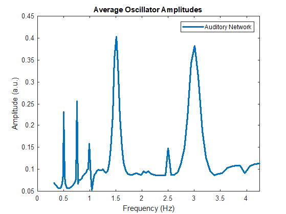

<!-- README.md is generated from README.Rmd. Please edit that file -->

# Two-Layer Gradient-Frequency Neural Network with Hebbian Learning

<!-- badges: start -->

<!-- badges: end -->

This is a MATLAB implementation of a two-layer gradient-frequency neural
network based off of [Tichko, Kim, & Large
(2021)](https://www.researchgate.net/publication/340967869_Bouncing_the_Network_A_Dynamical_Systems_Model_of_Auditory-Vestibular_Interactions_Underlying_Infants'_Perception_of_Musical_Rhythm),
who simulated auditory-vestibular interactions underlying infants’
perception of musical rhythm (e.g., [Phillips-Silver &
Trainor, 2005](https://science.sciencemag.org/content/308/5727/1430.abstract?casa_token=7m08V2fNsVMAAAAA:xoGCt6u7BKMu6pMT7I71NHdZ8tjGIdVYiFBpyuhOYJXcZrYS1Phu0-v28g3jE0g_vFz9FYqDHH2zNw)).
The model requires the [gradient-frequency neural network (GrFNN)
library for
MATLAB](https://github.com/MusicDynamicsLab/GrFNNToolbox).

## The Model

The model of auditory-vestibular interactions during infants’ processing
of musical rhythm was implemented as a two-layer oscillatory netural
network, with one network representing the auditory system, and the
other representing a distributed vestibular-motor system. The networks
are connected with auditory-motor efferent connections that allow
activity from the motor network to propogate to the auditory network.
The auditory network was equipped with a Hebbian plasticity rule to
model short-term plasticity in the auditory system.

## Simulations and Model Output

The main MATLAB script that trains the model is Training.m. There, users
can specify a model to be trained on either an unaccented musical
rhythm, vestibular input, or both. In addition to starting the training
sequence, running the training script will also create a folder called
“121” where figures of the model will be saved automatically at the
end of the simulation.

The output of the model is set to display oscillator amplitudes, the
auditory-vestibular inputs in the time domain, and the connection matrix
of the neural network, among other figures. To capture the average
oscillatory activity in the model during training, resonsant responses
are also calculated and plotted at the end of the simulation. For
example, below, we see the resonsant responses in the auditory network
of a model that was trained on both the unaccented rhythm and duple-rate
vestibular training. Note the large resonant responses that emerged at
1.5 Hz–the frequency of duple-rate vestibular input:

After training, models can be, then, be tested on an unaccented rhythm
using the Test.m script. Again, users can specify which model they would
like to test, and a figure of the resonsant responses from the test
procedure is automatically saved to the “121” folder.
